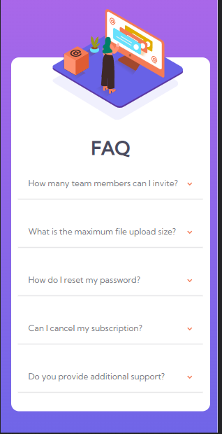
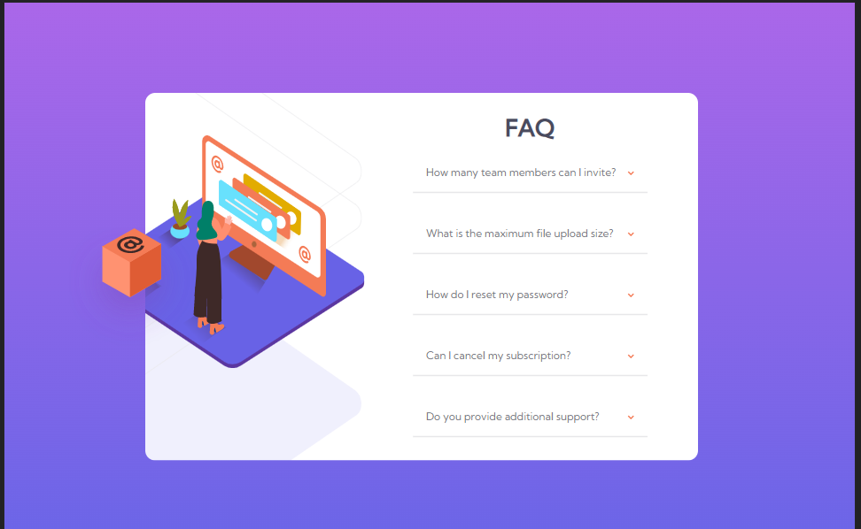
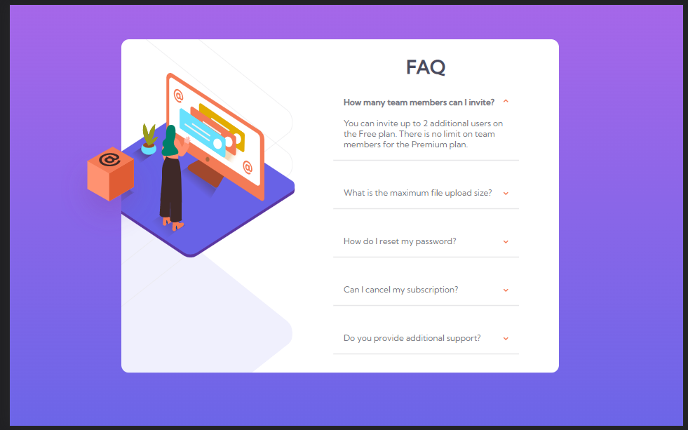

# Frontend Mentor - FAQ accordion card solution

This is a solution to the [FAQ accordion card challenge on Frontend Mentor](https://www.frontendmentor.io/challenges/faq-accordion-card-XlyjD0Oam). Frontend Mentor challenges help you improve your coding skills by building realistic projects. 

## Table of contents

- [Overview](#overview)
  - [The challenge](#the-challenge)
  - [Screenshot](#screenshot)
  - [Links](#links)
- [My process](#my-process)
  - [Built with](#built-with)
  - [What I learned](#what-i-learned)
  - [Continued development](#continued-development)
  - [Useful resources](#useful-resources)
- [Author](#author)

## Overview

### The challenge

Users should be able to:

- View the optimal layout for the component depending on their device's screen size
- See hover states for all interactive elements on the page
- Hide/Show the answer to a question when the question is clicked on the arrow.

### Screenshot








### Links

- Solution URL: [Solution](https://github.com/kurokurotho/faqs.github.io.git)
- Live Site URL: [Live site](https://kurokurotho.github.io/faqs.github.io/)

## My process

### Built with

- Semantic HTML5 markup
- CSS custom properties
- Flexbox
- CSS Grid

### What I learned

This project took me a long time to complete it but i learned a lot during this project.

```css
.proud-of-this-css {
  display: flex;
  flex-direction: column-reverse;
  align-items: flex-end;
}
```
Converting mobile responsive desing to larger screen design gave me a hard time .This above code helped me to align vertical desing into a horizontal design.

```js
for(let i =0;i<rt.length;i++){
    rt[i].lastElementChild.addEventListener('click',function()
    {
        rt[i].firstElementChild.classList.toggle('two');
        rt[i].lastElementChild.classList.toggle('rotate');
        rt[i].nextElementSibling.classList.toggle('ans')
    })
}
```
This Js code which makes the answer displayed while we click on the arrow.
Took me long enough to figure out right things.


### Continued development

This project is not as much responsive as it should have been,there a lot of the work should be done on its responsiveness.


### Useful resources

- [Resource 1](https://youtu.be/4qnWreynXLU) - This video helped me where i was getting wrong in my markup ,in css and Js.I took reference from this video for my js code.


## Author

- Frontend Mentor - [@kurokurotho](https://www.frontendmentor.io/profile/kurokurotho)
- Twitter - [@simple_smile9](https://twitter.com/simple_smile9)


